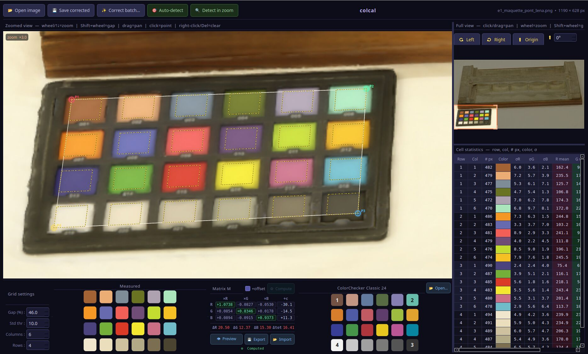

# colcal — Colour Calibration Tool  `v1.16`

A desktop application for **colour-matrix calibration** from a physical colour chart.
Shoot a colour chart alongside your subject, measure the patches, compute a correction matrix, and apply it to any number of images.

Built with **Python + PySide6 + NumPy**. No subscription, no cloud, no telemetry.

---

## Screenshot



---

## Features

### Colour chart localisation
- **Manual placement** — click four corners to define the chart quad on the zoomed view (top-left → top-right → bottom-right → bottom-left).
- **🎯 Auto-detect** — fully automatic detection over the entire image using a hybrid colour-matching + homography pipeline (multi-scale coarse search → Nelder-Mead refinement → iterative fine localisation by connected component → geometric validation and interpolation of missing cells). **The chart must be approximately horizontal and the right way up** — use the rotation buttons beforehand if needed. Both detection operations can be **cancelled** at any time with the Cancel button, including during the slow fine-localisation phase (per-cell progress is shown).
- **🔍 Detect in zoom** — same algorithm, restricted to the currently visible zoom window; useful when the chart occupies a small portion of a large image.
- After detection, a joint Nelder-Mead optimisation refines both the quad corners and the inter-cell gap simultaneously.

### Rotation
- **±90° buttons** for quick coarse rotation.
- **Spinbox (0–359°, step 1°)** showing the current angle at all times.
  - Scroll wheel: ±1° &emsp; Shift + scroll *or* right-click + scroll: ±5°
- The zoom-window centre and any existing quad points are automatically remapped when the rotation changes.

### Display brightness
A vertical slider on the left side of the zoomed view allows boosting the display brightness (0–200 levels). This is a **view-only** adjustment — it never affects saved or batch-processed images.
- Disabled automatically when corrected-preview mode is active.
- The boost is applied ~120 ms after the last slider movement (debounced) to avoid slowdowns.

### Colour correction computation

Two computation modes are available (checkboxes in the Matrix panel):

| Mode | Formula | Notes |
|------|---------|-------|
| **Direct** (unchecked) | fit `M` such that `M · measured ≈ reference` | straightforward |
| **Inverse** ✅ (default) | fit `F` such that `F · reference ≈ measured`, apply `F⁻¹` | statistically sounder — residuals live in the noisy measured space |

Each mode supports:
- **9-parameter** — pure 3×3 matrix.
- **12-parameter** (`+offset`) — affine transform with a per-channel bias, corrects global brightness or white-balance shifts.

Per-channel RMS residuals (ΔR, ΔG, ΔB, Δtot) are displayed after every computation.

### Fit residuals chart

After computing the matrix, the **Fit residuals** tab shows a per-patch bar chart:

- **X axis** — patch index numbered from 1, labelled `row,col` (1-based).
- **Y axis** — residual in sRGB 0–255 units, with auto-scaled nice-number tick marks.
- **Signed / Amplitude** toggle — switch between signed residuals (positive = under-predicted, negative = over-predicted) and absolute amplitude.
- **R / G / B / tot** channel toggles to show or hide individual channels.
- **Hover tooltip** — hovering a bar shows the patch number, row/col coordinates, and exact R/G/B/tot residual values.
- The chart switches to this tab automatically after each computation.

### Preview & export
- **👁 Preview** — live toggle between original and corrected image. If the matrix is recomputed while preview is active, the display updates automatically using the new matrix.
- **💾 Save corrected** — export the corrected image as PNG, TIFF, BMP, or JPEG.
- **✨ Correct batch…** — apply the correction to a folder of images in parallel (multi-threaded), with progress dialog and per-file result summary.
- **💾 Export / 📂 Import** — save and reload a correction as a JSON file (`matrix_<imagename>.json`).

File dialogs accept both lowercase and uppercase extensions (`.jpg` and `.JPG`, `.tiff` and `.TIFF`, etc.).

### Raw Bayer support
When a raw Bayer mosaic is detected, a debayering bar appears with three algorithms:
- **NN 2×2** — nearest-neighbour (fast, half resolution).
- **Bilinear 3×3** — standard bilinear interpolation (uses OpenCV if available, pure-NumPy fallback).
- **VNG (anti-moiré)** — Variable Number of Gradients, best quality.

Patterns supported: RGGB, BGGR, GRBG, GBRG.

### Zoom viewer
- Mouse drag to pan, scroll wheel to zoom, Shift + scroll to adjust the inter-cell gap.
- Cells with high colour std-dev are highlighted in red.
- Colour tooltip on hover over the measured or reference palette strips.

---

## Requirements

| Package | Version | Notes |
|---------|---------|-------|
| Python | ≥ 3.10 | f-strings, type unions |
| PySide6 | ≥ 6.4 | Qt 6 bindings |
| NumPy | ≥ 1.22 | core maths |
| OpenCV (`cv2`) | any | *optional* — faster debayering and auto-detect |
| Pillow | any | *optional* — batch processing fallback when cv2 absent |

OpenCV and Pillow are optional but recommended. Without them the application works fully via pure-NumPy paths that are somewhat slower.

---

## Installation

```bash
# 1. Clone
git clone https://github.com/your-username/colcal.git
cd colcal

# 2. Create a virtual environment (recommended)
python -m venv .venv
source .venv/bin/activate   # Windows: .venv\Scripts\activate

# 3. Install dependencies
pip install PySide6 numpy

# Optional but recommended:
pip install opencv-python-headless pillow
```

---

## Usage

```bash
# Make executable once (Linux / macOS)
chmod +x colcal.py

# Then launch directly
./colcal.py

# Or always via the interpreter
python colcal.py
```

### Typical workflow

1. **Open image** — click `📂 Open image` and select the photo containing the colour chart.
2. **Load palette** — click `📂 Open…` next to the palette strip and select `colorchart.json` (or your own palette file).
3. **Rotate if needed** — use the ±90° buttons or the angle spinbox so the chart is roughly horizontal and right-side up.
4. **Locate the chart** — click `🎯 Auto-detect`, or zoom in and click four corners manually.
5. **Adjust** — fine-tune the grid gap, rows, and columns in the settings panel if needed.
6. **Compute** — click `⚙ Compute`. The **Fit residuals** tab opens automatically showing per-patch errors.
7. **Preview** — click `👁 Preview` to verify the result visually on the image.
8. **Save** — click `💾 Save corrected` for a single image, or `✨ Correct batch…` for a whole folder.

### Keyboard shortcuts

| Key | Action |
|-----|--------|
| `←` / `→` | Rotate image ±90° |
| `↑` / `↓` | Zoom in / out |
| `Delete` / `Backspace` | Clear quad points |

---

## Palette JSON format

The `colorchart.json` file included in this repository contains the standard 24-patch **X-Rite ColorChecker Classic** reference values (sRGB, D50).

```json
{
  "name": "My Colour Chart",
  "palette": [
    [ [R, G, B], [R, G, B], ... ],
    [ [R, G, B], [R, G, B], ... ],
    ...
  ]
}
```

- `palette` is a list of rows, each a list of `[R, G, B]` values in **0–255 sRGB**.
- Row and column order must match the physical chart when the image is correctly oriented.
- The `name` field is optional and displayed in the UI.

---

## Correction JSON format

Exported corrections are plain JSON and can be reloaded or applied programmatically:

```json
{
  "description": "colcal colour correction",
  "image":   "photo.jpg",
  "palette": "colorchart.json",
  "model":   "inverse",
  "matrix":  [[...], [...], [...]],
  "coeffs":  [[...]],
  "formula": "..."
}
```

The `matrix` key holds the 3×3 application matrix. `offset` is present only in `+offset` modes.

### Applying a correction in Python without the GUI

```python
import json, numpy as np
from PIL import Image

with open("matrix_myphoto.json") as f:
    data = json.load(f)

model  = data.get("model", "linear")
M      = np.array(data["matrix"], dtype=np.float32)          # 3×3 application matrix
offset = np.array(data.get("offset", [0, 0, 0]), dtype=np.float32)

img = np.array(Image.open("photo.jpg")).astype(np.float32)
h, w, _ = img.shape
pixels = img.reshape(-1, 3)

if model in ("direct", "linear", "linear+offset"):
    # Direct model: corrected = M · rgb + offset  (sRGB space)
    corrected = pixels @ M.T + offset

elif model in ("inverse", "inverse+offset"):
    # Inverse model: F was fitted so that F · reference ≈ measured,
    # and M = F⁻¹ was stored. Apply: corrected = M · rgb + offset
    corrected = pixels @ M.T + offset

else:
    # Fallback for any future model: use the stored matrix as-is
    corrected = pixels @ M.T + offset

corrected = np.clip(corrected, 0, 255).astype(np.uint8).reshape(h, w, 3)
Image.fromarray(corrected).save("photo_corrected.png")
```

> **Note:** for both direct and inverse modes, the stored `matrix` is the ready-to-apply
> 3×3 transform (colcal pre-inverts `F` before saving). The `model` field is informational
> — the application formula is always `corrected = M · rgb + offset`.

---

## User preferences

colcal stores preferences (window geometry, last open directories, grid settings, Bayer options, matrix mode) using Qt's `QSettings` in INI format, written automatically on exit.

| Platform | Location |
|----------|----------|
| **Linux** | `~/.config/JoeSoft/colcal.ini` |
| **macOS** | `~/Library/Preferences/JoeSoft/colcal.ini` |
| **Windows** | `%APPDATA%\JoeSoft\colcal\colcal.ini` |

### Resetting preferences

```bash
# Linux
rm ~/.config/JoeSoft/colcal.ini

# macOS
rm ~/Library/Preferences/JoeSoft/colcal.ini

# Windows (PowerShell)
Remove-Item "$env:APPDATA\JoeSoft\colcal\colcal.ini"
```

### Uninstalling

colcal writes nothing outside its own directory except the preferences file above.

```bash
rm ~/.config/JoeSoft/colcal.ini   # delete preferences (Linux)
rm -rf /path/to/colcal/           # delete application directory
```

---

## Repository layout

```
colcal/
├── colcal.py           # main application (single file)
├── colorchart.json     # X-Rite ColorChecker Classic 24-patch reference
└── README.md
```

---

## Licence

MIT — see `LICENSE`.

---

## Acknowledgements

- Colour science fundamentals: *Digital Color Management* (Giorgianni & Madden).
- Reference sRGB values for the ColorChecker Classic: X-Rite / Calibrite.
- UI toolkit: [Qt / PySide6](https://doc.qt.io/qtforpython/).
